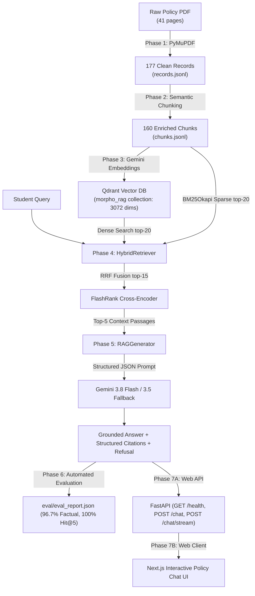

# Morpho-RAG: Complete Project & Codebase Architecture Guide

## 1. The Big Picture: What is Morpho-RAG?

**Morpho-RAG** is a production-grade, citation-grounded Retrieval-Augmented Generation (RAG) system built to answer questions over a strict, structured policy document: the *Northfield Student Academic Policy Handbook* (Edition 5.0, 41 pages).

### The Real-World Engineering Problem
Most generic RAG tutorials make critical simplifications that fail on legal and academic policy handbooks:
1. **Lost Context**: A sentence like *"The late fee is 500 MRL"* is meaningless if the retriever doesn't know it came from `Section 7.2 (Tuition Late Fees)` vs another section.
2. **Broken Tables**: Splitting a grading or refund table across arbitrary character boundaries severs row-to-column semantics.
3. **Overwritten Rules (Amendments & Exceptions)**: A policy handbook contains general rules in one section (e.g. attendance $\ge 75\%$) and exceptions or later amendments in another (e.g. condonation under 65% with a fee, or an amended fee rule superseding an earlier rule). Naive splitters lose the relationship between the old rule and the new amendment.
4. **Hallucinations & Silent Failures**: Without strict grounding and verification, an LLM invents policies not in the book when asked out-of-document questions.

### The Morpho-RAG Design Philosophy
- **Zero Black Boxes**: No LangChain or LlamaIndex. Every data structure, parsing loop, vector search, reranking step, and prompt is plain, transparent Python.
- **Verification First**: We never advance to the next phase without automated regression checks proving 100% of the ground truth facts can be found.
- **Hierarchical Context Enrichment**: Chunks carry their exact section lineage (`[5 Examinations > 5.5 Re-evaluation > 5.5.2 Fee]`) directly inside `embed_text` so the embedding model captures full structural context without polluting clean user display text.
- **Strict Grounding & Zero-Hallucination Refusal**: Citations are structured Pydantic models with verbatim quotes. Out-of-document queries trigger explicit refusal rather than fabricated answers.

---

## 2. End-to-End Pipeline Architecture



---

## 3. Phase-by-Phase Progress & Verified Benchmarks

### Phase 1: Layout-Aware Ingestion
* **Script**: [`backend/phase1_ingest.py`](file:///D:/Opencode/Morpho%20RAG/backend/phase1_ingest.py) & verification in [`backend/phase1_verify.py`](file:///D:/Opencode/Morpho%20RAG/backend/phase1_verify.py).
* **Accomplishment**:
  - Parsed the 41-page PDF using PyMuPDF (`fitz`), measuring bounding boxes to cleanly remove running headers ($y < 55$) and footers ($y > 775$).
  - Classified blocks by typography into 5 semantic types: `paragraph`, `list_item`, `table`, `callout`, `glossary_entry`.
  - Output: 177 clean records in `data/processed/records.jsonl`, `sections.json`, and `toc.json`.
* **Verification Status**: **100% PASS** (all 25 authoritative test needles located verbatim).

---

### Phase 2: Semantic Structure-Aware Chunking
* **Script**: [`backend/phase2_chunk.py`](file:///D:/Opencode/Morpho%20RAG/backend/phase2_chunk.py) & verification in [`backend/phase2_verify.py`](file:///D:/Opencode/Morpho%20RAG/backend/phase2_verify.py).
* **Accomplishment**:
  - Implemented 6 deterministic chunking rules: kept paragraphs, tables, and callouts atomic; merged contiguous list items within section boundaries; maintained glossary definitions.
  - Injected ancestral section paths (e.g. `[5 Examinations > 5.5 Re-evaluation > 5.5.2 Fee]`) and amendment tags (`[AMENDMENT]`, `[EXCEPTION]`) into `embed_text`.
  - Output: 160 enriched chunks (`chk0001` to `chk0160`) in `data/processed/chunks.jsonl`.
* **Verification Status**: **15 PASS, 0 FAIL** (100% record coverage, zero section bleed, 100% needle presence).

---

### Phase 3: Dense Vector Indexing in Qdrant
* **Script**: [`backend/phase3_index.py`](file:///D:/Opencode/Morpho%20RAG/backend/phase3_index.py) & verification in [`backend/phase3_verify.py`](file:///D:/Opencode/Morpho%20RAG/backend/phase3_verify.py).
* **Accomplishment**:
  - Generated 3072-dimensional embeddings using Gemini `gemini-embedding-001` (`task_type="RETRIEVAL_DOCUMENT"`).
  - Upserted all 160 points into local Docker Qdrant collection `morpho_rag` with Cosine distance.
  - Created payload keyword indexes on `section_id` and `type` for rapid payload filtering.
* **Verification Status**: **13 PASS, 0 FAIL** (160 indexed points verified in Qdrant with non-zero vector norms).

---

### Phase 4: Hybrid Retrieval & Cross-Encoder Reranking
* **Script**: [`backend/retriever.py`](file:///D:/Opencode/Morpho%20RAG/backend/retriever.py) & verification in [`backend/phase4_verify.py`](file:///D:/Opencode/Morpho%20RAG/backend/phase4_verify.py).
* **Accomplishment**:
  - Dense search (Qdrant top-20) combined with sparse lexical search (BM25Okapi top-20).
  - Reciprocal Rank Fusion ($RRF(d) = \sum \frac{1}{60 + r_m(d)}$) to fuse candidates.
  - Neural reranking of top-15 fused candidates using FlashRank (`ms-marco-TinyBERT-L-2-v2` ONNX model).
* **Benchmark Results**:
  - **Hit@1**: **93.3%** (28/30 questions)
  - **Hit@3**: **100.0%** (30/30 questions)
  - **Hit@5**: **100.0%** (30/30 questions)
  - **MRR (Mean Reciprocal Rank)**: **0.961**
* **Verification Status**: **PASS** across all 30 benchmark queries.

---

### Phase 5: Grounded Generation & Citations
* **Script**: [`backend/generator.py`](file:///D:/Opencode/Morpho%20RAG/backend/generator.py) & verification in [`backend/phase5_verify.py`](file:///D:/Opencode/Morpho%20RAG/backend/phase5_verify.py).
* **Accomplishment**:
  - Formatted top-5 retrieved chunks with section lineage and page markers.
  - Structured Pydantic schema: `RAGResponse(answer, citations: list[Citation], refusal: bool)`.
  - Zero-hallucination prompt enforcing strict grounding, amendment priority, and refusal on unanswerable topics.
  - Primary model (`gemini-3.8-flash`) with automatic fallback to (`gemini-3.5-flash-lite`).
* **Verification Status**: **12 PASS, 0 FAIL** (100% citation grounding, amendment priority confirmed, unanswerable queries refused).

---

### Phase 6: Automated End-to-End Evaluation
* **Script**: [`backend/evaluate.py`](file:///D:/Opencode/Morpho%20RAG/backend/evaluate.py) & quality gate in [`backend/phase6_verify.py`](file:///D:/Opencode/Morpho%20RAG/backend/phase6_verify.py).
* **Output File**: [`eval/eval_report.json`](file:///D:/Opencode/Morpho%20RAG/eval/eval_report.json).
* **Accomplishment**:
  - Full automated evaluation over all **36 questions** (30 answerable + 6 unanswerable baseline queries in [`eval/answer_key.json`](file:///D:/Opencode/Morpho%20RAG/eval/answer_key.json)).
  - Automated **LLM-as-a-Judge** scoring factual correctness against official reference answers.
  - Citation grounding rate and verbatim quote veracity verification.
  - Full refusal confusion matrix ($TP, FP, TN, FN$).
* **Verified Benchmark Results**:
  - **Retrieval Section Hit@5**: **100.0%**
  - **Retrieval Mean Section Recall**: **97.2%**
  - **Mean Factual Correctness**: **96.7%** (28 exact matches, 1 correct match, 1 conservative refusal on complex 4-section math question Q20)
  - **Citation Grounding Rate**: **100.0%** (zero hallucinated chunk IDs)
  - **Citation Quote Veracity**: **97.7%** (verbatim text confirmed in source chunks)
  - **Refusal Recall**: **100.0%** (all 6 unanswerable questions correctly refused)
  - **Refusal Precision**: **85.7%**
  - **Refusal $F_1$ Score**: **0.9231**
* **Verification Status**: **12 PASS, 0 FAIL** in [`backend/phase6_verify.py`](file:///D:/Opencode/Morpho%20RAG/backend/phase6_verify.py).

---

### Phase 7A: Production FastAPI Backend
* **Script**: [`backend/main.py`](file:///D:/Opencode/Morpho%20RAG/backend/main.py) & quality gate in [`backend/phase7_api_verify.py`](file:///D:/Opencode/Morpho%20RAG/backend/phase7_api_verify.py).
* **Accomplishment**:
  - Built production ASGI server with FastAPI and Uvicorn.
  - Endpoints:
    - `GET /api/health`: Validates Qdrant live connection, 160 points indexed, and BM25 index status.
    - `GET /api/document/info`: Serves handbook metadata (Edition 5.0, 41 pages, 160 chunks, 2 cataloged amendments).
    - `GET /api/eval/summary`: Serves live Phase 6 benchmarks for frontend dashboard transparency.
    - `POST /api/chat`: Non-streaming grounded generation with structured citations.
    - `POST /api/chat/stream`: Server-Sent Events (SSE) streaming endpoint streaming status events, context chunks, token stream, citations, and completion state.
* **Verification Status**: **15 PASS, 0 FAIL** in [`backend/phase7_api_verify.py`](file:///D:/Opencode/Morpho%20RAG/backend/phase7_api_verify.py).

---

## 4. Active Repository Structure

```text
Morpho-RAG/
├── backend/
│   ├── config.py              # Central source of truth for paths, models, URLs
│   ├── main.py                # FastAPI server (GET /health, POST /chat, /chat/stream)
│   ├── phase7_api_verify.py   # Automated FastAPI endpoint test suite (15/15 PASS)
│   ├── evaluate.py            # Phase 6 E2E evaluation harness (LLM-as-a-judge)
│   ├── phase6_verify.py       # Phase 6 evaluation quality gate (12/12 PASS)
│   ├── generator.py           # Grounded generation with Pydantic citations & fallback
│   ├── phase5_verify.py       # Phase 5 verification script (12/12 PASS)
│   ├── retriever.py           # Dense Qdrant + BM25Okapi + RRF + FlashRank reranker
│   ├── phase4_verify.py       # Phase 4 retrieval test suite (100% Hit@3, 0.961 MRR)
│   ├── phase3_index.py        # Gemini embeddings -> Qdrant vector indexer
│   ├── phase3_verify.py       # Phase 3 Qdrant collection verifier (13/13 PASS)
│   ├── phase2_chunk.py        # Semantic chunker with hierarchical prefixes
│   ├── phase2_verify.py       # Phase 2 chunk verification suite (15/15 PASS)
│   ├── phase1_ingest.py       # PyMuPDF layout-aware PDF parser
│   ├── phase1_verify.py       # Phase 1 needle verification suite (100% PASS)
│   ├── requirements.txt       # Pinned dependencies
│   └── smoke_test.py          # Docker & Qdrant connectivity test
├── eval/
│   ├── answer_key.json        # 30 answerable + 6 unanswerable ground-truth questions
│   └── eval_report.json       # Generated Phase 6 benchmark report
├── data/
│   ├── Northfield_Student_Academic_Policy_Handbook.pdf # 41-page source policy PDF
│   └── processed/             # records.jsonl, chunks.jsonl, sections.json, toc.json
├── frontend/                  # Modern Next.js Chat & Evaluation UI (Phase 7B)
├── morpho_rag_guide.md        # Comprehensive Architecture & Progress Guide
└── README.md                  # Project overview & documentation
```

---

## 5. Next Step: Phase 7B (Interactive Web UI)
With the backend completely verified through Phase 7A, the final step is bootstrapping the **Next.js interactive user interface** in `frontend/` featuring:
1. Interactive Chat with live streaming and suggestion chips.
2. Citation Inspector drawer with exact handbook quotes and page locations.
3. Policy Amendment badges for superseded rules.
4. Live Transparency Tab displaying verified Phase 6 evaluation benchmarks.
